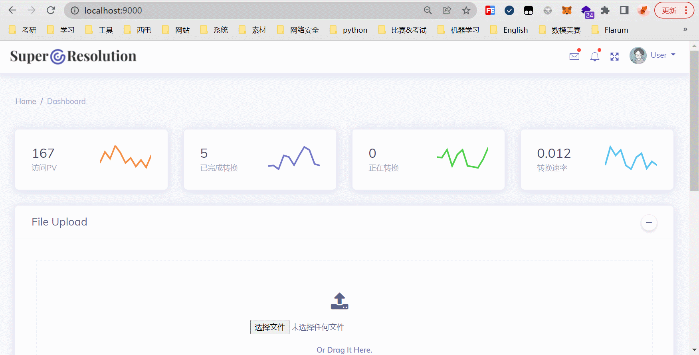
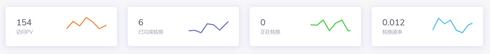
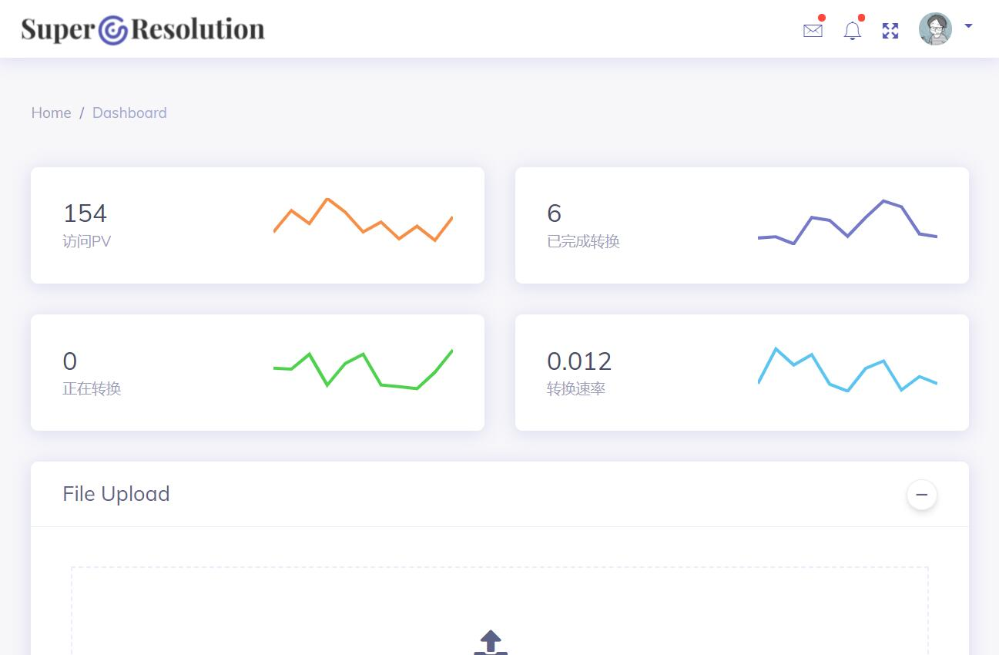
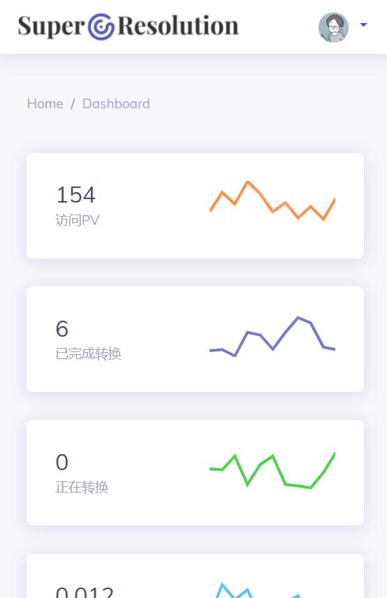
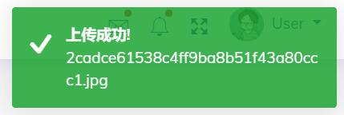

# 可视化部署

### 1.使用
```shell
# 环境配置
pip install -r requirements.txt
# 启动服务
python app.py
```
### 2.特性
#### 2.1 Echarts数据可视化


#### 2.2 jQuery + Ajax
页面数据实时加载&更新

#### 2.3 Bootstrap栅栏特性（页面自适应）
- 平板端  

- 手机端  


#### 2.4 Toastr人性化提示

